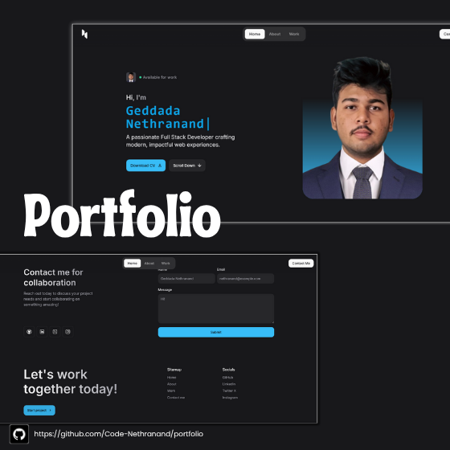

<p align="center">
  
</p>


# Nethranand's Portfolio

A modern, responsive, and interactive portfolio website built with React, Tailwind CSS, and Vite. Showcasing projects, skills, and contact information for Geddada Nethranand, Full Stack Developer & Data Analyst.

## 🚀 Features

- **Animated Hero Section** with typewriter/hacker effect
- **Responsive Design** for all devices
- **Smooth Scrolling** and reveal animations (GSAP, Lenis)
- **Project Gallery** with live links
- **Skills & Tools** grid
- **Contact Form** (Getform.io integration)
- **Social Links** and accessible navigation
- **Dark UI** with Tailwind CSS
- **SEO-friendly** and performant

## 🛠️ Tech Stack

- [React](https://react.dev/)
- [Vite](https://vitejs.dev/)
- [Tailwind CSS](https://tailwindcss.com/)
- [GSAP](https://greensock.com/gsap/)
- [Lenis](https://lenis.studiofreight.com/)
- [PropTypes](https://reactjs.org/docs/typechecking-with-proptypes.html)
- [Getform.io](https://getform.io/) (for contact form)
- [Vercel Analytics](https://vercel.com/analytics)

## 📦 Getting Started

### Prerequisites

- [Node.js](https://nodejs.org/) (v18+ recommended)
- [npm](https://www.npmjs.com/) or [yarn](https://yarnpkg.com/)

### Installation

```bash
git clone https://github.com/Code-Nethranand/portfolio.git
cd portfolio
npm install
```

### Development

```bash
npm run dev
```

Open [http://localhost:5173](http://localhost:5173) to view the site.

### Production Build

```bash
npm run build
npm run preview
```

## 📁 Project Structure

```
src/
  components/    # Reusable React components
  images/        # Static assets
  index.css      # Tailwind CSS styles
  App.jsx        # Main app entry
  main.jsx       # React DOM entry
public/
  images/        # Public images (favicon, logo, etc.)
```

## ✨ Customization

- Update your details in `src/components/Hero.jsx`, `About.jsx`, and `Footer.jsx`.
- Add or edit projects in `src/components/Work.jsx`.
- Update skills in `src/components/Skill.jsx`.
- Replace images in `/public/images/`.

## 📬 Contact

For questions, suggestions, or collaborations, reach out via [email](mailto:nethranand12345@gmail.com) or use the contact form on the site.

## 🤝 Contributing

Pull requests are welcome! For major changes, please open an issue first to discuss what you would like to change.

## 📝 License

This project is licensed under the [Apache 2.0 License](LICENSE).

---

> Built with ❤️ by [Geddada Nethranand](https://github.com/Code-Nethranand)
